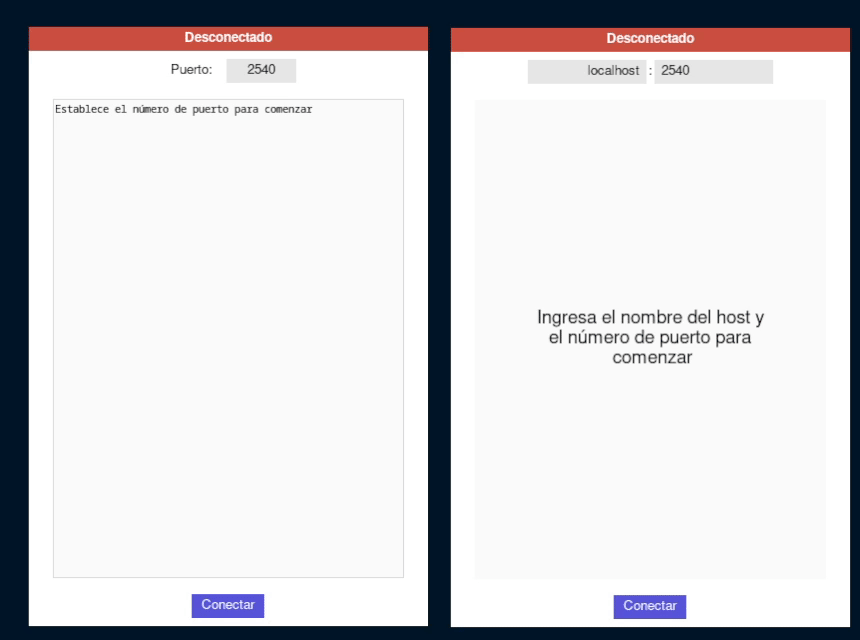

# TCL/TK mini-chat

This is a simple chat application with an echo server using sockets with a
graphical interface.



## Running the application

Make sure you have Tcl and Tk installed.

```bash
git clone https://github.com/ggzor/Redes
cd Redes

# To run the server
wish servidor.tcl

# To run the client
wish client.tcl
```

